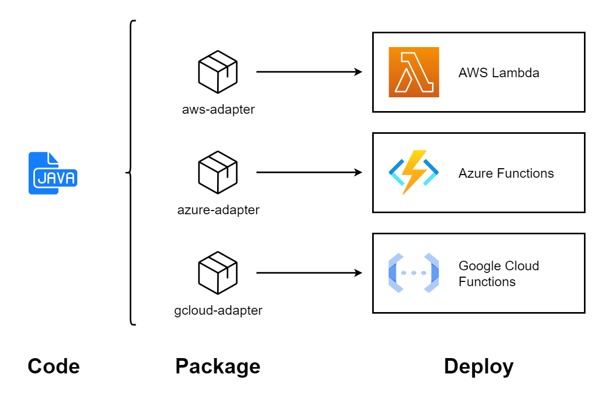

# Agnostic Serverless Functions in Java

Serverless functions are a great way to deploy backend services at a low cost. However, while the infrastructure is abstracted, the code has a strong dependency on the framework used. When a serverless function has been developed targeting a specific FaaS provider, switching to another provider requires some refactoring.

This project aims at reducing the dependency of serverless functions to a specific framework. An *agnostic serverless function* is here defined as a serverless function that doesn't have a direct dependency (in its code or in its configuration) to the framework of a particular FaaS provider.

With this project, the same code can be compiled to a function deployable on any supported FaaS platform. Currently, this project supports the following providers (other providers will be added in the future):

- AWS Lambda
- Azure Functions
- Google Cloud Functions

## Example

Check out [this template repository](https://github.com/axel-op/agnostic-serverless-functions-java-example) for a complete example of an agnostic serverless function in Java.

## Usage

<p align="center"></p>

### Code

The class containing the agnostic function must implement the [`Handler`](./interfaces/src/main/java/fr/axelop/agnosticserverlessfunctions/Handler.java) interface. It must be [registered as a *service provider*](https://docs.oracle.com/en/java/javase/11/docs/api/java.base/java/util/ServiceLoader.html) so it can be loaded with a `ServiceLoader`. This means that there must be a resource file `META-INF/services/fr.axelop.agnosticserverlessfunctions.Handler` containing the fully qualified binary name of your handler class (in this example, it would be `com.example.MyHandler`). You can automate this process by using the [Google @AutoService](https://github.com/google/auto/tree/master/service) annotation.

There can only be one handler in your JAR.

```java
package com.example;

import java.util.logging.Logger;

import fr.axelop.agnosticserverlessfunctions.Handler;
import fr.axelop.agnosticserverlessfunctions.HttpRequest;
import fr.axelop.agnosticserverlessfunctions.HttpResponse;

public class MyHandler implements Handler {

    @Override
    public HttpResponse handle(HttpRequest request, Logger logger) {
        return HttpResponse.newBuilder()
                .setStatusCode(200)
                .setBody(request.getBody().isPresent()
                        ? "The request body was: " + request.getBody().get()
                        : "There was no body in this " + request.getMethod() + " request!")
                .build();
    }

}
```

### Configuration

You'll need to add two dependencies from [my Maven repository](https://github.com/axel-op/maven-packages):

- [`interfaces`](https://github.com/axel-op/maven-packages/packages/1617850) contains the classes that will be used to code the agnostic function.
- `adapter` will add the classes needed to execute the function on the selected cloud provider.

```xml
<!-- pom.xml -->
<project>

    <properties>
        <!-- Can be: aws, azure, gcloud -->
        <!-- This property can also be set by a command-line parameter -->
        <faas.provider>gcloud</faas.provider>
    </properties>

    <dependencies>
        <dependency>
            <groupId>fr.axelop.agnosticserverlessfunctions</groupId>
            <artifactId>interfaces</artifactId>
            <version>0.0.1-SNAPSHOT</version>
        </dependency>

        <dependency>
            <groupId>fr.axelop.agnosticserverlessfunctions</groupId>
            <artifactId>${faas.provider}-adapter</artifactId>
            <version>0.0.1-SNAPSHOT</version>
            <scope>runtime</scope>
        </dependency>
    </dependencies>

</project>
```

### Packaging and deployment

These steps are specific to each FaaS provider:

- [AWS Lambda](./aws-adapter/README.md)
- [Azure Functions](./azure-adapter/README.md)
- [Google Cloud Functions](./gcloud-adapter/README.md)

If you're using GitHub Actions, use [`agnostic-serverless-functions-java-package-action`](https://github.com/axel-op/agnostic-serverless-functions-java-package-action) to package your function.

## Advantages

- Scalability: the deployment of the same code on different providers can be completely automated.
- Migration: as there is no direct dependency between the business logic and the provider-specific framework, it's easy to switch to a different provider without modifying the code at all.
- A/B testing: a same function can be deployed on multiple providers at the same time, making it easy to compare their performance.

## Limitations and future improvements

### Limited trigger types

For now, this project can only deploy HTTP-triggered functions.

### Non-agnostic packaging and deployment

While they can be entirely automated, the packaging and deployment steps differ between the cloud providers. A possible improvement is to script them so they can be triggered by a unique command.
